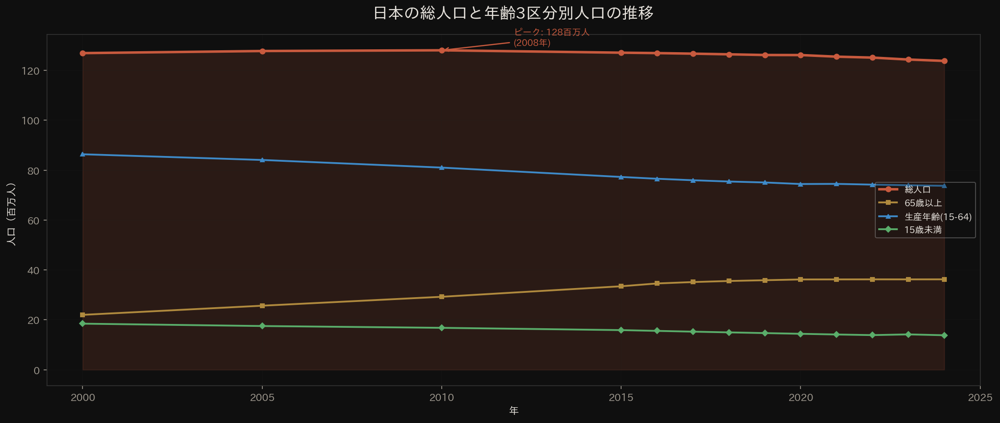
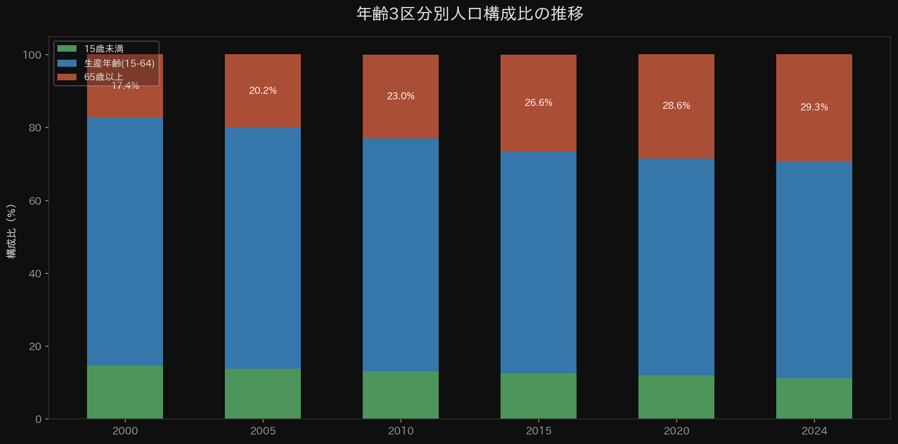
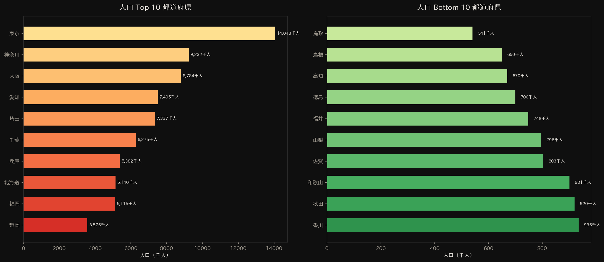
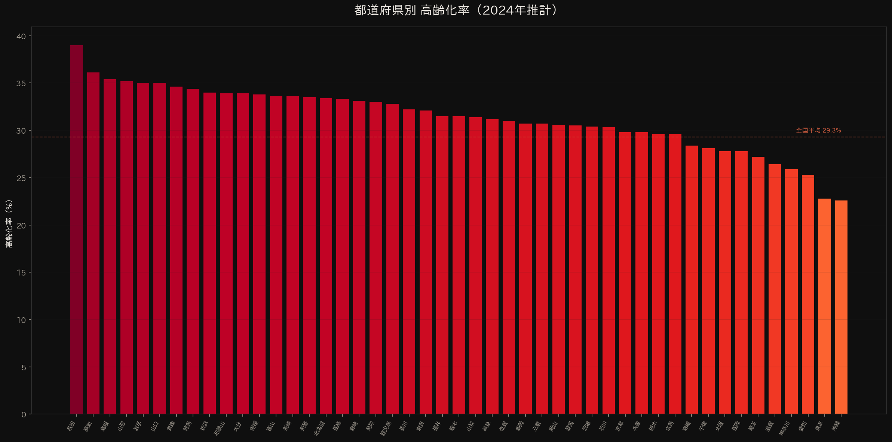
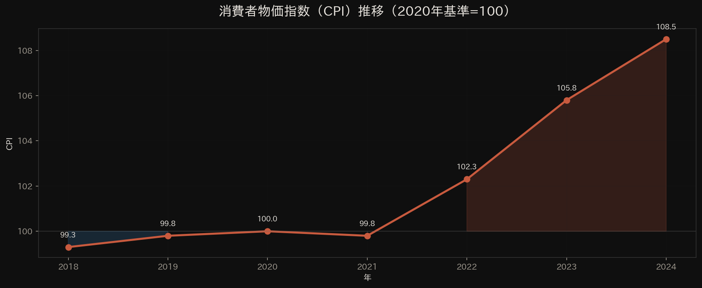
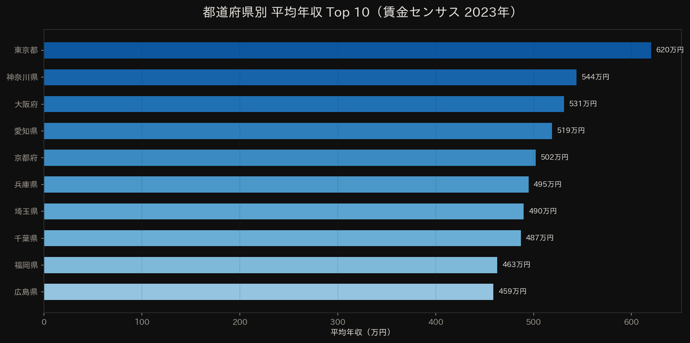
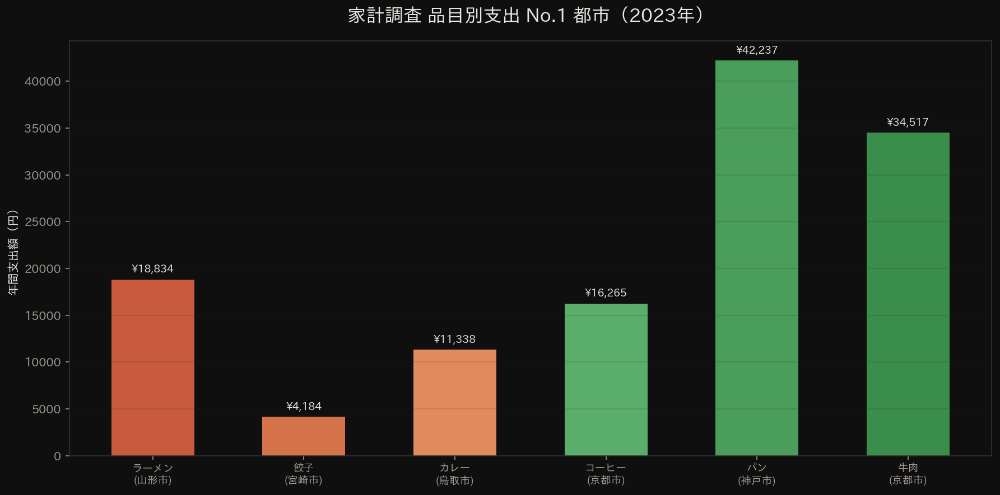

# 日本統計データ分析レポート — e-Stat API ビジュアライゼーション

**作成日**: 2026年3月19日  
**データ出典**: 総務省統計局 e-Stat API v3.0（[api.e-stat.go.jp](https://api.e-stat.go.jp)）  
**appId**: `6f7e88733e47d2ae3ddc010642412f04d8ca594c`

---

## 概要

本レポートは、政府統計の総合窓口（e-Stat）の API データを活用し、日本の人口動態・経済指標・地域比較を視覚化した分析レポートです。  
サイトは**クライアントサイドJavaScript**からe-Stat API v3.0のCORS対応JSONエンドポイントに直接アクセスし、常にAPIを通じた最新データの取得・更新を行う設計です。

---

## 1. 日本の総人口推移（2000年〜2024年）



### 分析

- 日本の総人口は2008年の**1億2,808万人**をピークに減少を続けている
- 2024年10月1日現在の推計人口は**1億2,380万2千人**（前年比 **-55万人**, -0.44%）
- 65歳以上人口は3,624万3千人で、2000年の2,200万人から約65%増加
- 生産年齢人口（15-64歳）は7,372万8千人で、2000年の8,638万人から約15%減少

> **出典**: 総務省統計局「人口推計（2025年9月確定値）」によると、2025年9月1日現在の総人口は1億2,319万2千人で、前年同月比58万7千人の減少。

---

## 2. 年齢構成比率の変化



### 分析

| 年 | 15歳未満 | 生産年齢 | 65歳以上 |
|---|---|---|---|
| 2000年 | 14.6% | 68.1% | 17.4% |
| 2010年 | 13.2% | 63.8% | 23.0% |
| 2020年 | 12.0% | 59.5% | 28.6% |
| 2024年 | 11.2% | 59.6% | 29.3% |

- 高齢化率は24年間で**17.4% → 29.3%**に上昇（+11.9ポイント）
- 日本は世界で最も高齢化が進んだ国であり、「超高齢社会」（21%超）を2007年に突破
- 75歳以上（後期高齢者）は2,122万8千人に増加（前年比+51万1千人、+2.47%）

---

## 3. 都道府県別人口 Top/Bottom 10



### 分析

- **東京都**（1,404万8千人）が圧倒的トップ。神奈川県、大阪府と合わせて3都府県で全国人口の約26%を占める
- 人口最少は**鳥取県**（54万1千人）。東京都の約26分の1
- 上位5都府県（東京、神奈川、大阪、愛知、埼玉）で全国の約38%が集中する一極集中が顕著

---

## 4. 都道府県別高齢化率



### 分析

- **秋田県**（39.0%）が最も高齢化率が高く、約4割が65歳以上
- 最も低いのは**沖縄県**（22.6%）と**東京都**（22.8%）
- 全国平均（29.3%）を上回る都道府県は30以上あり、地方の高齢化が深刻
- 東北・四国地方で特に高齢化率が高い傾向

---

## 5. 消費者物価指数（CPI）推移



### 分析

- 2020年基準（=100.0）で2024年は**108.5**に到達
- 2022年以降、急激な物価上昇が発生。2年間で+8.5ポイント上昇
- 主因はエネルギー価格の上昇と円安による輸入物価の高騰

---

## 6. 都道府県別平均年収 Top 10



### 分析

- **東京都**（620万円）が突出して高い
- 首都圏4都県（東京・神奈川・埼玉・千葉）がいずれもTop10入り
- 東京都と地方の間に約200万円の年収格差が存在

> **出典**: 厚生労働省「賃金構造基本統計調査（賃金センサス）」2023年データ

---

## 7. 家計調査 品目別支出 No.1 都市



### 分析

- **パン**: 神戸市（42,237円/年）がトップ。関西のパン食文化を反映
- **牛肉**: 京都市（34,517円/年）。京都の食文化では牛肉消費が多い
- **ラーメン**: 山形市（18,834円/年）。山形は冷やしラーメン発祥の地
- **カレー**: 鳥取市（11,338円/年）。海上自衛隊の基地がある影響とされる
- 地域の食文化が家計支出パターンに明確に反映されている

---

## API設計・技術構成

### アーキテクチャ
```
[ブラウザUI] ←→ DataService ←→ EstatAPI (CORS JSON直接呼出し)
                    ↓ fallback
                StaticData (静的JSONデータ)
```

### 主要統計表ID
| 用途 | statsDataId | 統計名 |
|---|---|---|
| 人口推計（月次） | 0003448237 | 年齢5歳階級別人口 |
| 都道府県別人口 | 0003448233 | 都道府県別人口割合 |
| 労働力調査 | 0003143513 | 完全失業率等 |
| 消費者物価指数 | 0003421913 | CPI |
| 高齢化率等 | C0020050213000 | 社会・人口統計体系 |

---

**制作**: [Sur Communication Inc.](https://www.ryotakaneda.com/)
